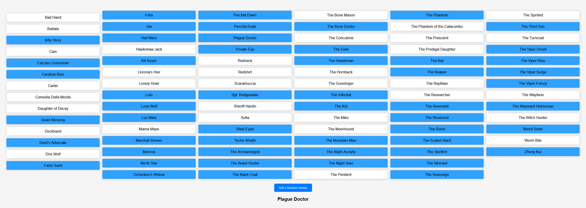

# Hunt Showdown Legendary Hunter Randomizer

The Hunt Showdown Legendary Hunter Randomizer is a simple, intuitive, and interactive tool that randomly selects a legendary hunter from the game Hunt Showdown. This tool aims to help users who are indecisive or simply want a randomized selection. Now, the tool also includes a night mode for a more comfortable viewing experience in low-light conditions.

## Features

- A complete list of legendary hunters from Hunt Showdown.
- An interactive selection interface allowing users to select or deselect any hunter. The selected hunters are highlighted.
- A "Roll a Random Hunter" button to randomly select a hunter from the selected ones.
- The selections are saved in the browser's local storage, so they persist across sessions.
- A "Toggle Night Mode" button to switch between day mode (default) and night mode for a more comfortable viewing experience in low-light conditions.
- Aesthetic and easy-to-use interface with a column-wise arrangement of hunters for a better visual experience.

## Implementation

This web tool is implemented using HTML, CSS, and JavaScript. The CSS styles have been updated to provide a column-wise layout, better user experience, and a night mode.

The JavaScript handles user interaction, selection persistence using the local storage, the random selection of a hunter, and the switching between day and night modes.

## How to Use

- Select your preferred hunters from the list. You can select as many as you want. The selected hunters will be highlighted.
- Click the "Roll a Random Hunter" button. The randomly selected hunter will be displayed.
- Click the "Toggle Night Mode" button to switch between day mode and night mode.
- Your selections and mode preference are automatically saved and will be available for the next session.

Enjoy the randomization and may the odds be in your favor in the swamps of Hunt Showdown!
